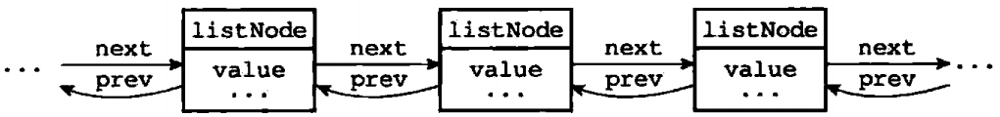

# 链表

### 3.1 链表和链表节点的实现

每个链表节点使用一个 adlist.h/listNode 表示：

```c
typedef struct listNode {
    struct listNode *prev;
    struct listNode *next;
    void *value;
} listNode;
```

多个 listNode 可以通过 prev 和 next 指针组成双向链表，如图 3-1 所示

<figure><figcaption><p>图 3-1 由多个 listNode 组成的双向链表</p></figcaption></figure>

虽然仅仅使用多个 listNode 结构就可以组成链表，但是使用 adlist.h/list 来持有链表的话，操作起来更方便。

<pre class="language-cpp"><code class="lang-cpp">typedef struct list {
<strong>    // 头节点
</strong>    listNode *head;
    // 尾节点
    listNode *tail;
    // 节点值复制函数         
    void *(*dup)(void *ptr);
    // 节点值释放函数    
    void (*free)(void *ptr);
    // 节点值对比函数
    int (*match)(void *ptr, void *key);
    // 节点数量
    unsigned long len;
} list;
</code></pre>

图 3-2 是由一个 list 结构和三个 listNode 结构组成的链表。

<figure><figcaption><p>图3-2 由 list 结构和 listNode 结构组成的链表</p></figcaption></figure>

